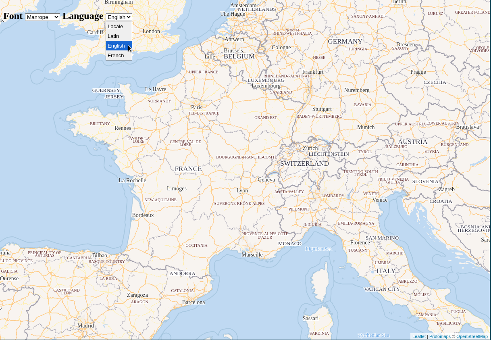

# leaflet-pmtiles

A toolset to visualise PMTiles more easily in Leaflet.js (based on https://github.com/protomaps/protomaps-leaflet).

Demos:
* [OpenMapTiles rendering](https://kalisio.github.io/leaflet-pmtiles/openmapstyle.html)

## Build

To build distribution files locally run: 
```
npm run dist
```

## Getting started

See :open_file_folder: [demo](./demo) folder for examples.

To run the demos locally:
1) launch `npm run dev` to build and copy distribution files into the dist/demo folder on any change,
2) launch `npm run demo` in another terminal to serve and update the demo files on any change,
3) serve your PMTiles with `http-server -p 8081 --cors` and adjust the URL as required in demo files,
4) open eg http://127.0.0.1:8080/openmaptiles.html in your browser

## Features

### Mapbox style

The module exposes a `mapbox_style` function generating paint and labels rules from a [Mapbox style is a JSON document](https://docs.mapbox.com/help/glossary/style/). This is typically useful to render PMTiles created from the [OpenMapTiles profile](https://github.com/openmaptiles/planetiler-openmaptiles).



> [!NOTE]
> Have a look to the related demo if you'd like to customize default fonts.

This feature is based on inital work done by [protomaps-leaflet](https://github.com/protomaps/protomaps-leaflet) contributors (please refer to https://github.com/protomaps/protomaps-leaflet/issues/121 for more details).

### Leaflet path style

The module exposes a `leaflet_style` function generating paint rules from [Leafet path style options](https://leafletjs.com/reference.html#path) as typically used to visualize GeoJson features in Leaflet. This is typically useful to render similarly PMTiles created from GeoJson datasets. As a PMTiles might contains multiple layers, you need to specify the target layer as the second argument of the style function.

> [!NOTE]
> Have a look to the related demo for more details.

### Enhanced path style

**Coming soon**
